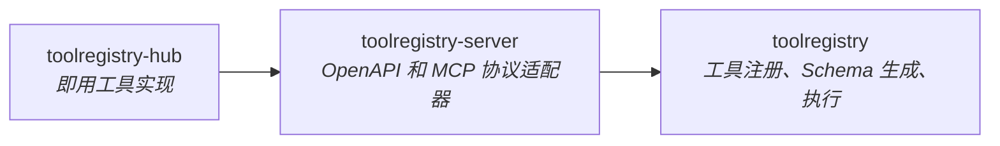

# ToolRegistry

[](https://pypi.org/project/toolregistry/)
[](https://github.com/Oaklight/ToolRegistry/releases/latest)
[](https://github.com/Oaklight/ToolRegistry/actions/workflows/ci.yml)
[](https://opensource.org/licenses/MIT)
[](https://deepwiki.com/Oaklight/toolregistry)

[English Version](README_en.md) | [中文版](README_zh.md)

一个协议无关的工具管理库，面向支持函数调用的大语言模型。

**[文档](https://toolregistry.readthedocs.io)** · **[arXiv 论文](https://arxiv.org/abs/2507.10593)**

## 生态系统

| 包 | 描述 | PyPI | 文档 |
|---|------|------|------|
| **toolregistry** | 核心库 — 工具注册、Schema 生成、执行 | [](https://pypi.org/project/toolregistry/) | [文档](https://toolregistry.readthedocs.io/) |
| **toolregistry-server** | 服务端适配器 — 通过 OpenAPI 和 MCP 暴露工具 | [](https://pypi.org/project/toolregistry-server/) | [文档](https://toolregistry-server.readthedocs.io/) |
| **toolregistry-hub** | 即用工具集 — 计算器、网页搜索、文件操作等 | [](https://pypi.org/project/toolregistry-hub/) | [文档](https://toolregistry-hub.readthedocs.io/) |



## 特性

- **协议无关** — 通过统一接口注册原生 Python 函数/类、MCP 服务器、OpenAPI 规范或 LangChain 工具
- **多 Provider Schema** — 通过 [llm-rosetta](https://github.com/Oaklight/llm-rosetta) 生成 OpenAI、Anthropic、Gemini 格式的工具 Schema
- **并发执行** — 线程和进程池后端，支持按工具设置超时和并发控制
- **权限系统** — 基于标签的策略（`READ_ONLY`、`DESTRUCTIVE`、`NETWORK` 等），支持允许/拒绝/询问规则
- **工具元数据与标签** — 通过 `ToolTag`、`ToolMetadata`、命名空间和来源追踪对工具进行分类
- **管理面板** — 内置 Web UI，监控工具、权限和运行时配置（国际化：中/英）
- **思维增强调用** — 在工具调用中注入思维链推理（[arXiv:2601.18282](https://arxiv.org/abs/2601.18282)）
- **声明式配置** — 从 JSONC/YAML 配置文件加载工具源
- **零依赖核心** — HTTP 客户端、YAML 解析器、JSON Schema 解析器全部内置；仅 `pydantic` 和 `llm-rosetta` 作为运行时依赖

## 快速开始

```python
from toolregistry import ToolRegistry

registry = ToolRegistry()

@registry.register
def add(a: float, b: float) -> float:
    """将两个数字相加。"""
    return a + b

# 适配任意 LLM Provider
schemas = registry.get_schemas(api_format="openai-chat")  # 或 "anthropic"、"gemini"
result = registry["add"](1, 2)  # 3.0
```

更多用法请参阅[使用指南](https://toolregistry.readthedocs.io/en/stable/usage/basics.html)，涵盖 MCP、OpenAPI、LangChain 集成等。

## 安装

需要 **Python >= 3.10**。

```bash
pip install toolregistry                   # 核心
pip install toolregistry[mcp]              # + MCP 支持
pip install toolregistry[langchain]        # + LangChain 支持
pip install toolregistry-hub               # 即用工具集（独立包）
```

## 引用

```bibtex
@software{toolregistry2025,
  title={ToolRegistry: A Protocol-Agnostic Tool Management Library for OpenAI-Compatible LLM Applications},
  author={Peng Ding},
  year={2025},
  url={https://github.com/Oaklight/ToolRegistry},
  note={A Python library for unified tool registration, execution, and management across multiple protocols in OpenAI-compatible LLM applications}
}

@article{ding2025toolregistry,
  title={ToolRegistry: A Protocol-Agnostic Tool Management Library for Function-Calling LLMs},
  author={Ding, Peng},
  journal={arXiv preprint arXiv:2507.10593},
  year={2025}
}
```

## 许可证

MIT — 详情请参阅 [LICENSE](LICENSE)。
