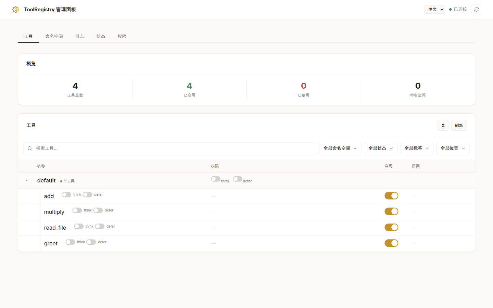
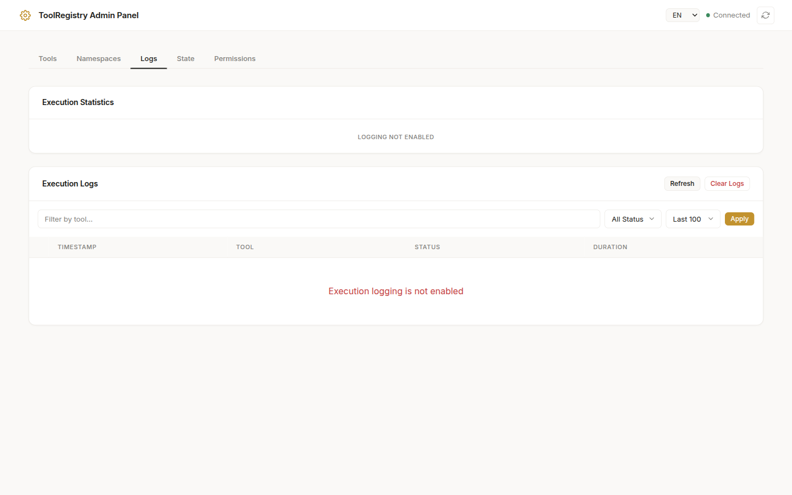
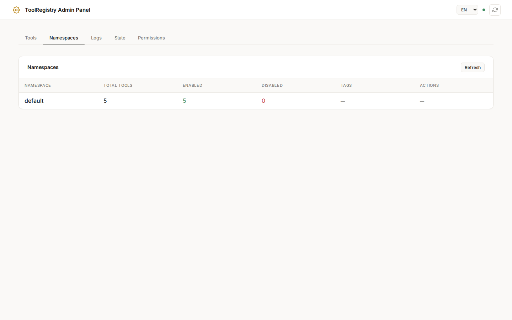

# Admin Panel

The Admin Panel provides a built-in HTTP server for managing and monitoring your ToolRegistry instance. It offers both a REST API and an optional web-based UI for real-time tool management.

## Overview

The Admin Panel is designed with the following principles:

- **Minimalism**: Zero external dependencies - uses only Python's standard library (`http.server`)
- **Zero Configuration**: Works out of the box with sensible defaults
- **Universality**: Compatible with any HTTP client or browser
- **Security**: Built-in token authentication for remote access

### Key Features

- Enable/disable tools and namespaces at runtime
- View tool schemas and metadata
- Monitor execution logs with filtering and statistics
- Export/import registry state
- Web UI for visual management

### Screenshots


*Tools tab: View and manage all registered tools with search, filter, and enable/disable controls.*


*Logs tab: Monitor execution history with status filtering and performance statistics.*


*Namespaces tab: Manage tool groups with namespace-level enable/disable controls.*

## Quick Start

### Basic Usage

```python
from toolregistry import ToolRegistry

# Create registry and register tools
registry = ToolRegistry()

@registry.register
def my_tool(x: int) -> int:
    """Multiply input by 2."""
    return x * 2

# Enable the admin panel
info = registry.enable_admin(port=8081)
print(f"Admin panel: {info.url}")
```

### Accessing the Web UI

Once enabled, open your browser and navigate to the URL printed (e.g., `http://localhost:8081`). The web UI provides:

- Tool list with enable/disable toggles
- Namespace management
- Execution log viewer
- State export/import functionality
