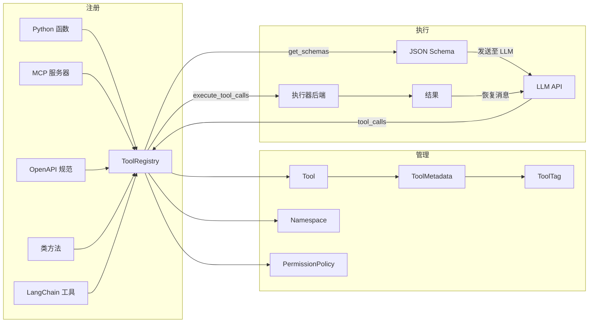
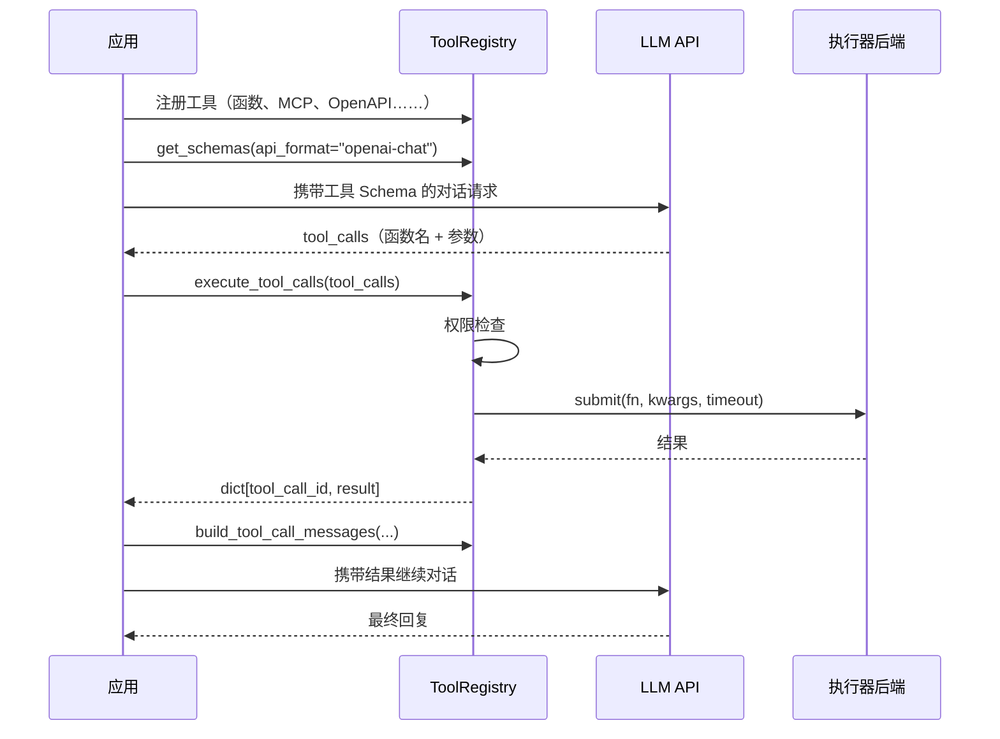

# 架构概览

## 目标受众

ToolRegistry 为**智能体开发者**设计 — 即构建 AI 智能体和 LLM 驱动应用的工程师，这些应用需要根据模型决策调用外部函数（工具）。如果你的应用使用任何 LLM API 的函数调用 / 工具调用功能，ToolRegistry 为你提供统一的工具注册、管理和执行方式。

## 什么是函数调用？

现代 LLM 不仅能生成文本，还能决定**调用函数**来完成任务。这被称为*函数调用*（function calling）或*工具调用*（tool calling）：

1. 你以 JSON Schema 的形式向 LLM 描述可用的工具（函数）
2. LLM 分析用户请求，决定调用哪个工具、传入什么参数
3. 你的应用执行工具并将结果返回给 LLM
4. LLM 将结果纳入最终回复

ToolRegistry 管理整个生命周期：从多种来源注册工具、为任意 LLM API 格式生成 Schema、并发执行调用、以及恢复多轮对话消息。

## 核心概念



### ToolRegistry

核心协调器。持有 `Tool` 对象集合，提供以下能力：

- **注册**来自多种来源的工具（函数、MCP、OpenAPI、类、LangChain）
- **生成**各 API 格式的 Schema（OpenAI、Anthropic、Gemini）
- **执行**工具调用，支持可配置的并发后端
- **控制访问**，通过权限策略和元数据标签
- **组织**工具到命名空间中

### Tool

基本单元 — 将可调用对象与其名称、描述、参数 Schema 和元数据包装在一起。通过 `Tool.from_function()` 创建，或在集成注册时自动创建。

### ToolMetadata 与 ToolTag

元数据为工具提供分类和执行提示：

- **标签**（`ToolTag`）：预定义标签，如 `READ_ONLY`、`DESTRUCTIVE`、`NETWORK`、`PRIVILEGED`
- **自定义标签**：用户定义的字符串，用于领域特定分类
- **执行提示**：`timeout`、`is_concurrency_safe`、`locality`

标签驱动权限系统 — 你编写基于标签匹配的规则，而不是工具名称。

### Namespace

从外部来源（MCP 服务器、OpenAPI 规范、类）注册的工具被组织到命名空间中。命名空间防止名称冲突，并支持注册表之间的选择性 `merge()` / `spinoff()` 操作。

### PermissionPolicy

规则引擎，在执行前评估工具调用。规则按顺序检查（首次匹配生效），产生 `ALLOW`、`DENY` 或 `ASK`（委托给处理器）。未设置策略时，所有调用默认允许。

## 执行管线

使用 ToolRegistry 的典型函数调用工作流：



## 执行器后端

ToolRegistry 使用可插拔后端进行并发执行：

| 后端 | 并行方式 | 取消机制 | 适用场景 |
|------|---------|---------|---------|
| `ThreadBackend` | GIL 限制的线程 | 协作式（`ExecutionContext`） | 本地 CPU 密集型函数 |
| `ProcessPoolBackend` | 真正的多进程 | 硬取消（`future.cancel()`） | 网络 I/O、崩溃隔离 |

进程模式为默认。详见[执行模式](../usage/concurrency_modes.md)的基准测试和配置说明。

## 集成架构

ToolRegistry 支持五种工具来源，每种都有专用的集成适配器：

| 来源 | 注册方法 | 连接方式 |
|------|---------|---------|
| Python 函数 | `@registry.register` | 直接调用 |
| MCP 服务器 | `register_from_mcp()` | 持久连接（默认） |
| OpenAPI 规范 | `register_from_openapi()` | 持久 HTTP 连接池（默认） |
| 类方法 | `register_from_class()` | 直接调用 |
| LangChain 工具 | `register_from_langchain()` | 直接调用 |

MCP 和 OpenAPI 集成默认维护**持久连接**。使用 `ToolRegistry` 作为上下文管理器可自动清理：

```python
with ToolRegistry() as registry:
    registry.register_from_mcp("http://localhost:8000/mcp")
    registry.register_from_openapi(client_config=config, openapi_spec=spec)
    # ... 使用工具 ...
# 所有连接自动关闭
```

## 多格式 Schema 支持

ToolRegistry 通过 [llm-rosetta](https://pypi.org/project/llm-rosetta/) 为多种 LLM API 格式生成工具 Schema：

```python
# OpenAI Chat Completion 格式（默认）
registry.get_schemas(api_format="openai-chat")

# Anthropic 格式
registry.get_schemas(api_format="anthropic")

# Google Gemini 格式
registry.get_schemas(api_format="gemini")
```

详见 [LLM API 格式](../usage/providers/openai_chat.md)章节的各格式集成指南。
