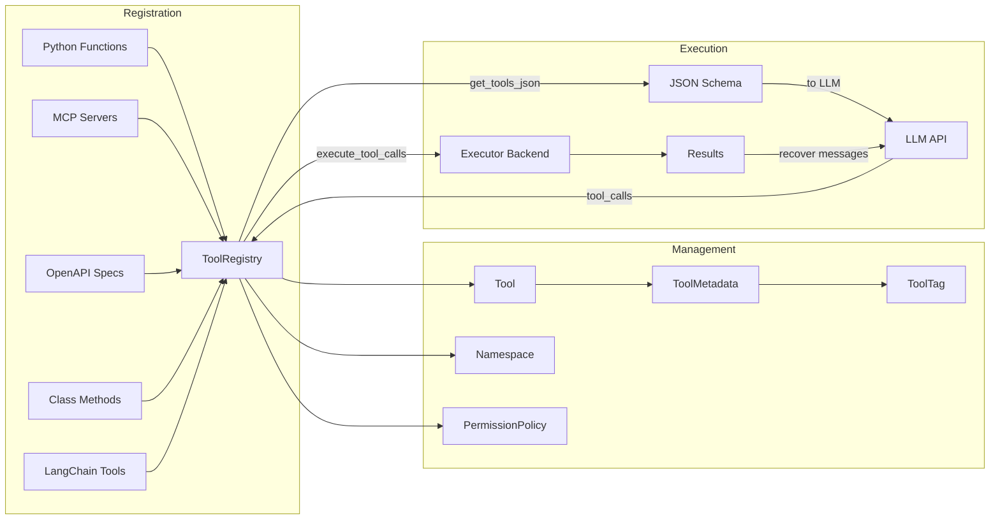
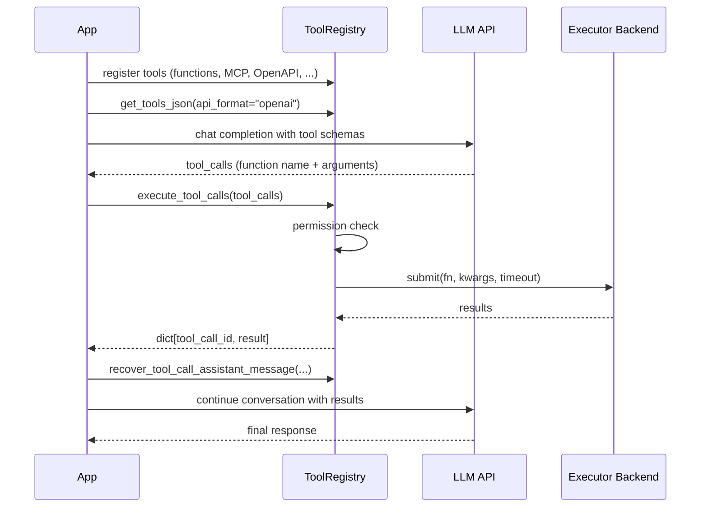

# Architecture Overview

## Who Is This For?

ToolRegistry is designed for **agent developers** — engineers building AI agents and LLM-powered applications that need to call external functions (tools) based on model decisions. If your application uses function calling / tool calling with any LLM API, ToolRegistry gives you a unified way to register, manage, and execute those tools.

## What Is Function Calling?

Modern LLMs can do more than generate text — they can decide to **call functions** to accomplish tasks. This is known as *function calling* or *tool calling*:

1. You describe available tools (functions) to the LLM as JSON schemas
2. The LLM analyzes the user's request and decides which tool(s) to call, with what arguments
3. Your application executes the tool(s) and returns results to the LLM
4. The LLM incorporates the results into its response

ToolRegistry manages the entire lifecycle: registering tools from diverse sources, generating schemas for any LLM API format, executing calls concurrently, and recovering messages for multi-turn conversations.

## Core Concepts



### ToolRegistry

The central orchestrator. It holds a collection of `Tool` objects and provides methods to:

- **Register** tools from multiple sources (functions, MCP, OpenAPI, classes, LangChain)
- **Generate schemas** for multiple API formats (OpenAI, Anthropic, Gemini)
- **Execute** tool calls concurrently with configurable backends
- **Control access** via permission policies and metadata tags
- **Organize** tools into namespaces

### Tool

The fundamental unit — wraps a callable with its name, description, parameter schema, and metadata. Tools are created via `Tool.from_function()` or automatically during integration registration.

### ToolMetadata & ToolTag

Metadata enriches tools with classification and execution hints:

- **Tags** (`ToolTag`): Predefined labels like `READ_ONLY`, `DESTRUCTIVE`, `NETWORK`, `PRIVILEGED`
- **Custom tags**: User-defined strings for domain-specific classification
- **Execution hints**: `timeout`, `is_concurrency_safe`, `locality`

Tags drive the permission system — you write rules that match on tags rather than tool names.

### Namespace

Tools are organized into namespaces when registered from external sources (MCP servers, OpenAPI specs, classes). Namespaces prevent name collisions and enable selective `merge()` / `spinoff()` operations between registries.

### PermissionPolicy

A rule engine that evaluates tool calls before execution. Rules are checked in order (first match wins), producing `ALLOW`, `DENY`, or `ASK` (delegate to a handler). If no policy is set, all calls are allowed.

## Execution Pipeline

A typical function calling workflow with ToolRegistry:



## Executor Backends

ToolRegistry uses pluggable backends for concurrent execution:

| Backend | Parallelism | Cancellation | Best For |
|---------|-------------|-------------|----------|
| `ThreadBackend` | GIL-limited threads | Cooperative (`ExecutionContext`) | Local CPU-bound functions |
| `ProcessPoolBackend` | True multiprocess | Hard (`future.cancel()`) | Network I/O, crash isolation |

Process mode is the default. See [Execution Modes](../usage/concurrency_modes.md) for benchmarks and configuration.

## Integration Architecture

ToolRegistry supports five tool sources, each with a dedicated integration adapter:

| Source | Registration Method | Connection |
|--------|-------------------|------------|
| Python functions | `@registry.register` | Direct |
| MCP servers | `register_from_mcp()` | Persistent (default) |
| OpenAPI specs | `register_from_openapi()` | Persistent HTTP pool (default) |
| Class methods | `register_from_class()` | Direct |
| LangChain tools | `register_from_langchain()` | Direct |

MCP and OpenAPI integrations maintain **persistent connections** by default. Use `ToolRegistry` as a context manager for automatic cleanup:

```python
with ToolRegistry() as registry:
    registry.register_from_mcp("http://localhost:8000/mcp")
    registry.register_from_openapi(client_config=config, openapi_spec=spec)
    # ... use tools ...
# All connections closed automatically
```

## Multi-Format Schema Support

ToolRegistry generates tool schemas for multiple LLM API formats via [llm-rosetta](https://pypi.org/project/llm-rosetta/):

```python
# OpenAI Chat Completion format (default)
registry.get_tools_json(api_format="openai")

# Anthropic format
registry.get_tools_json(api_format="anthropic")

# Google Gemini format
registry.get_tools_json(api_format="gemini")
```

See the [LLM API Formats](../usage/providers/openai_chat.md) section for format-specific integration guides.
