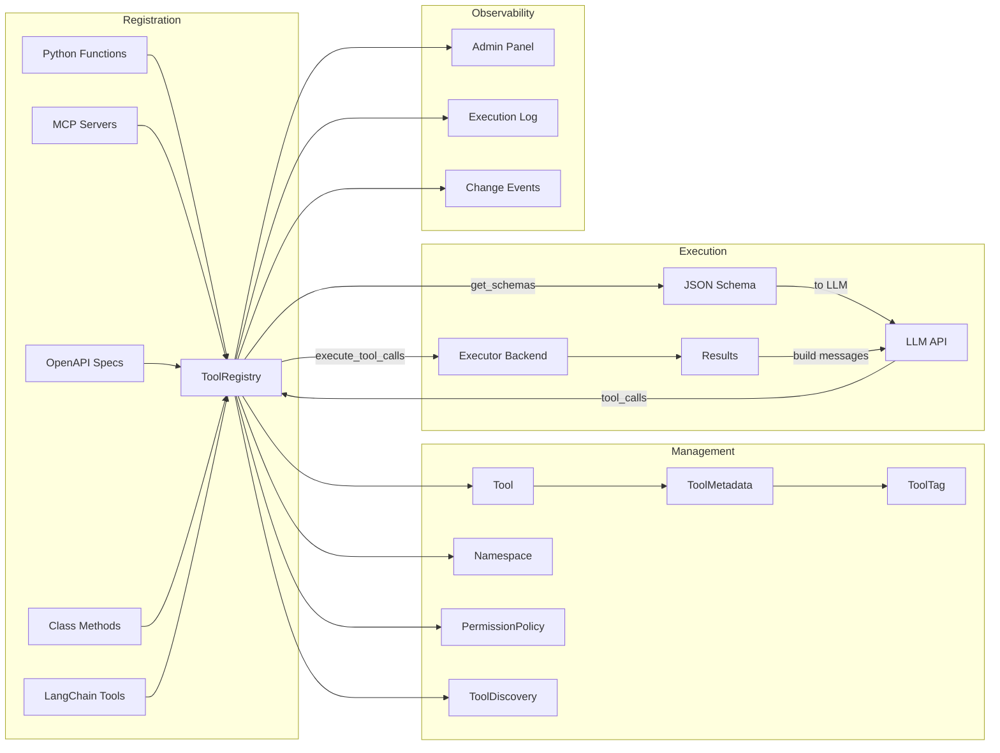
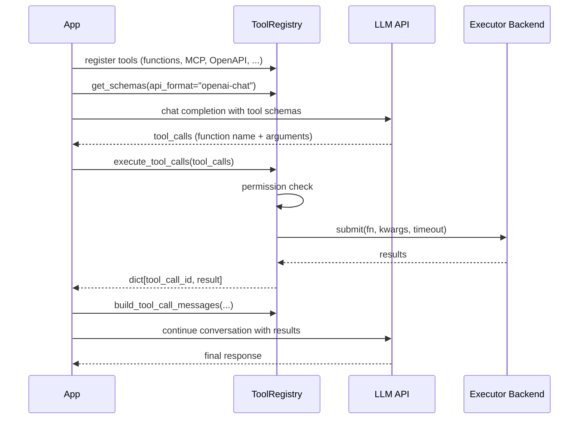

# Architecture Overview

## Who Is This For?

ToolRegistry is designed for **agent developers** — engineers building AI agents and LLM-powered applications that need to call external functions (tools) based on model decisions. If your application uses function calling / tool calling with any LLM API, ToolRegistry gives you a unified way to register, manage, and execute those tools.

## What Is Function Calling?

Modern LLMs can do more than generate text — they can decide to **call functions** to accomplish tasks. This is known as *function calling* or *tool calling*:

1. You describe available tools (functions) to the LLM as JSON schemas
2. The LLM analyzes the user's request and decides which tool(s) to call, with what arguments
3. Your application executes the tool(s) and returns results to the LLM
4. The LLM incorporates the results into its response

ToolRegistry manages the entire lifecycle: registering tools from diverse sources, generating schemas for any LLM API format, executing calls concurrently, and building messages for multi-turn conversations.

## High-Level Architecture



## Package Structure

The source code is organized into focused subpackages, each with a clear responsibility:

```
toolregistry/
├── tool_registry.py        # ToolRegistry — central orchestrator (composed via mixins)
├── tool.py                 # Tool, ToolMetadata, ToolTag
├── tool_wrapper.py         # Base wrapper for tool execution
├── tool_discovery.py       # BM25-based tool discovery for LLMs
├── parameter_models.py     # JSON Schema generation from type hints
├── events.py               # ChangeEvent & ChangeCallback
├── truncation.py           # Result size management
├── _rosetta.py             # Schema format conversion (via llm-rosetta)
│
├── _mixins/                # ToolRegistry composition (7 mixins)
│   ├── registration.py     #   register_from_*() methods
│   ├── namespace.py        #   namespace management, merge/spinoff
│   ├── permissions.py      #   permission policy integration
│   ├── admin.py            #   admin panel lifecycle
│   ├── enable_disable.py   #   tool availability control
│   ├── logging.py          #   execution logging
│   └── callbacks.py        #   change event callbacks
│
├── executor/               # Execution backends (zero toolregistry imports)
│   ├── _protocol.py        #   ExecutionBackend & ExecutionHandle ABCs
│   ├── _thread_backend.py  #   ThreadBackend
│   ├── _process_backend.py #   ProcessPoolBackend
│   └── _types.py           #   ExecutionContext, ExecutionStatus, ProgressReport
│
├── integrations/           # External tool source adapters
│   ├── native/             #   Python class method integration
│   ├── mcp/                #   Model Context Protocol (stdio/SSE/streamable)
│   ├── openapi/            #   OpenAPI REST endpoint integration
│   └── langchain/          #   LangChain BaseTool adapter
│
├── permissions/            # Permission system
│   ├── policy.py           #   PermissionPolicy & PermissionRule
│   ├── handler.py          #   sync & async PermissionHandler
│   ├── types.py            #   PermissionRequest & PermissionResult
│   └── builtin_rules.py    #   Pre-built common rules
│
├── types/                  # Type definitions & schema formats
│   ├── common.py           #   ToolCall, ToolCallResult, message builders
│   ├── content_blocks.py   #   TextBlock, ImageBlock (multimodal results)
│   ├── openai/             #   OpenAI Chat & Response API formats
│   ├── anthropic/          #   Anthropic format
│   └── gemini/             #   Google Gemini format
│
├── admin/                  # Web-based admin panel
│   ├── server.py           #   AdminServer (stdlib HTTP)
│   ├── handlers.py         #   REST API request handlers
│   ├── execution_log.py    #   ExecutionLog & ExecutionLogEntry
│   └── auth.py             #   Token-based authentication
│
├── config/                 # Configuration file loading
├── hub/                    # ToolRegistry Hub integration
└── _vendor/                # Vendored zero-dep utilities
    ├── sparse_search.py    #   BM25/BM25F index for tool discovery
    ├── jsonc.py            #   JSONC parser
    └── yaml.py             #   YAML parser
```

## Core Concepts

### ToolRegistry (Mixin Composition)

`ToolRegistry` is the central orchestrator. Rather than placing all functionality in a single class, it is composed from **seven focused mixins**:

| Mixin | Responsibility |
|-------|---------------|
| `RegistrationMixin` | `register_from_mcp()`, `register_from_openapi()`, `register_from_class()`, `register_from_langchain()` |
| `NamespaceMixin` | Namespace management, `merge()` / `spinoff()` between registries |
| `PermissionsMixin` | Permission policy attachment and enforcement |
| `EnableDisableMixin` | Enable / disable individual tools at runtime |
| `ExecutionLoggingMixin` | Execution log integration |
| `AdminMixin` | Admin panel lifecycle (`start_admin()` / `stop_admin()`) |
| `ChangeCallbackMixin` | `on_change()` callbacks for tool registration/removal events |

This composition pattern keeps each concern isolated and testable while presenting a unified API through the `ToolRegistry` class.

### Tool

The fundamental unit — wraps a callable with its name, description, parameter schema, and metadata. Key fields:

- **`name`** — unique identifier within a registry
- **`description`** — what the tool does (sent to the LLM)
- **`parameters`** — JSON Schema generated from type hints
- **`callable`** — the underlying function (excluded from serialization)
- **`metadata`** — execution hints and classification (see below)
- **`namespace`** — group membership for collision avoidance
- **`method_name`** — original function name before namespace prefixing

Tools are created via `Tool.from_function()` or automatically during integration registration.

### ToolMetadata & ToolTag

Metadata enriches tools with classification and behavioral hints:

| Field | Purpose |
|-------|---------|
| `tags` | Predefined labels: `READ_ONLY`, `DESTRUCTIVE`, `NETWORK`, `FILE_SYSTEM`, `SLOW`, `PRIVILEGED` |
| `custom_tags` | User-defined strings for domain-specific classification |
| `timeout` | Per-call timeout in seconds |
| `is_concurrency_safe` | Whether the tool can be run in parallel |
| `locality` | `"local"` / `"remote"` / `"any"` — execution location hint |
| `max_result_size` | Truncation threshold (characters); oversized results spill to a temp file |
| `defer` | Exclude from initial prompt; discoverable via `ToolDiscoveryTool` |
| `search_hint` | Extra keywords for BM25 discoverability |
| `think_augment` | Per-tool override for thought-augmented calling |
| `extra` | Arbitrary key-value pairs for application-specific use |

Tags drive the permission system — you write rules that match on tags rather than tool names.

### Namespace

Tools registered from external sources (MCP servers, OpenAPI specs, classes) are automatically grouped into namespaces. Namespaces:

- Prevent name collisions between tools from different sources
- Enable selective `merge()` / `spinoff()` operations between registries
- Prefix tool names as `{namespace}-{method_name}`

### PermissionPolicy

A rule engine that evaluates tool calls before execution. Rules are checked in order (first match wins), producing `ALLOW`, `DENY`, or `ASK` (delegate to a handler for interactive approval). If no policy is set, all calls are allowed. See [permissions docs](../usage/permissions.md) for details.

## Execution Pipeline

A typical function calling workflow:



## Executor Backends

ToolRegistry uses pluggable backends for concurrent execution. The executor module has **zero imports from toolregistry** — it is a standalone, protocol-first subsystem.

| Backend | Parallelism | Cancellation | Best For |
|---------|-------------|-------------|----------|
| `ThreadBackend` | GIL-limited threads | Cooperative (`ExecutionContext`) | Local CPU-bound functions |
| `ProcessPoolBackend` | True multiprocess | Hard (`future.cancel()`) | Network I/O, crash isolation |

Both backends return an `ExecutionHandle` with uniform `cancel()`, `status()`, `result()`, and `on_progress()` methods.

Process mode is the default. See [Execution Modes](../usage/concurrency_modes.md) for benchmarks and configuration.

## Integration Architecture

ToolRegistry supports five tool sources, each with a dedicated integration adapter under `integrations/`:

| Source | Registration Method | Connection | Namespace |
|--------|-------------------|------------|-----------|
| Python functions | `@registry.register` | Direct | None |
| MCP servers | `register_from_mcp()` | Persistent (stdio/SSE/streamable HTTP) | Auto |
| OpenAPI specs | `register_from_openapi()` | Persistent HTTP pool | Auto |
| Class methods | `register_from_class()` | Direct (bound to instance) | Auto |
| LangChain tools | `register_from_langchain()` | Direct | Auto |

MCP and OpenAPI integrations maintain **persistent connections** by default. Use `ToolRegistry` as a context manager for automatic cleanup:

```python
with ToolRegistry() as registry:
    registry.register_from_mcp("http://localhost:8000/mcp")
    registry.register_from_openapi(client_config=config, openapi_spec=spec)
    # ... use tools ...
# All connections closed automatically
```

## Tool Discovery

When registries grow large, sending all tool schemas in every prompt wastes tokens and may confuse the LLM. The **tool discovery** system addresses this:

1. Mark tools as `defer=True` in their metadata — their schemas are excluded from the initial prompt
2. A built-in `discover_tools` tool is injected into the registry
3. The LLM calls `discover_tools(query="...")` to find relevant tools by natural language
4. Matched tool schemas are injected into the conversation on demand

The search backend uses **BM25F scoring** (vendored, zero external dependencies) across multiple fields: tool name, description, tags, parameter names, and `search_hint`. See [Tool Discovery](../usage/tool_discovery.md) for configuration.

## Think-Augmented Tool Calling

ToolRegistry can inject a `thought` property into every tool's JSON schema, prompting the LLM to include step-by-step reasoning when selecting and calling tools. This improves tool selection accuracy in complex scenarios.

- Registry-level: `registry.get_schemas(..., think=True)`
- Per-tool override: `metadata.think_augment = True / False`

Reference: [Xu et al., 2025](https://arxiv.org/abs/2601.18282)

## Multi-Format Schema Support

ToolRegistry generates tool schemas for multiple LLM API formats via [llm-rosetta](https://pypi.org/project/llm-rosetta/):

```python
# OpenAI Chat Completion format (default)
registry.get_schemas(api_format="openai-chat")

# OpenAI Response API format
registry.get_schemas(api_format="openai-response")

# Anthropic format
registry.get_schemas(api_format="anthropic")

# Google Gemini format
registry.get_schemas(api_format="gemini")
```

Message builders (`build_assistant_message`, `build_tool_response`) are also format-aware, so multi-turn conversations work uniformly across providers.

## Multimodal Content Blocks

Tools can return rich content beyond plain text using **content blocks**:

- `TextBlock` — plain text segment
- `ImageBlock` — base64-encoded image with media type

When a tool result contains content blocks, ToolRegistry automatically expands them into a user message that all LLM APIs can consume, regardless of format differences.

## Observability

### Admin Panel

A built-in web UI and REST API for inspecting registry state at runtime:

- View all registered tools, their schemas, metadata, and namespaces
- Browse execution logs with timing, arguments, and results
- Token-based authentication for production use
- Starts on a local HTTP port via `registry.start_admin()`

### Execution Logging

Every tool call executed through the registry is recorded in an `ExecutionLog` with:

- Tool name, arguments, and result
- Execution duration and status (success / error / timeout)
- Timestamp

### Change Events

Register callbacks via `registry.on_change()` to react to tool lifecycle events (registration, removal, enable/disable). Useful for dynamic UIs, logging, or triggering schema regeneration.

See the [Admin Panel](../admin/index.md) section for full documentation.
