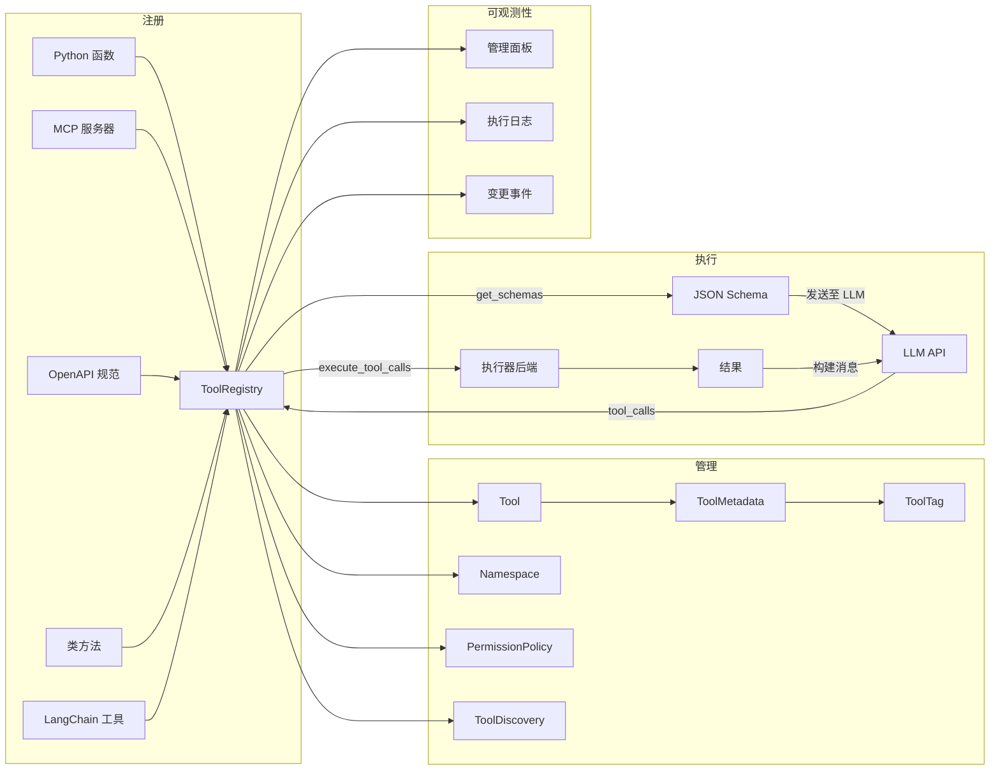
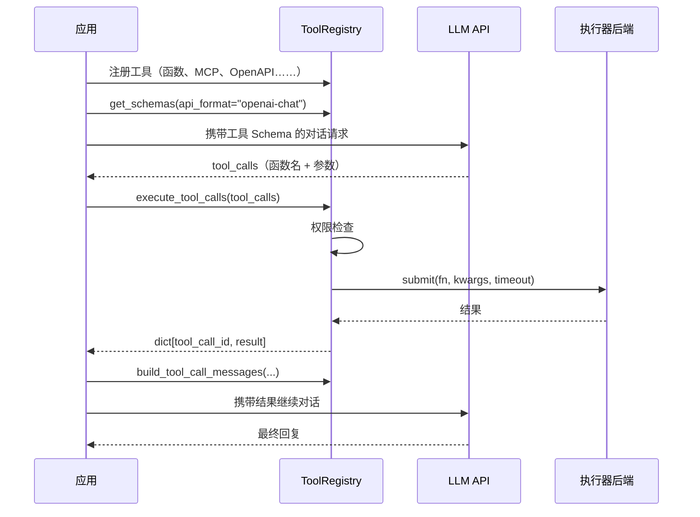

# 架构概览

## 目标受众

ToolRegistry 为**智能体开发者**设计 — 即构建 AI 智能体和 LLM 驱动应用的工程师，这些应用需要根据模型决策调用外部函数（工具）。如果你的应用使用任何 LLM API 的函数调用 / 工具调用功能，ToolRegistry 为你提供统一的工具注册、管理和执行方式。

## 什么是函数调用？

现代 LLM 不仅能生成文本，还能决定**调用函数**来完成任务。这被称为*函数调用*（function calling）或*工具调用*（tool calling）：

1. 你以 JSON Schema 的形式向 LLM 描述可用的工具（函数）
2. LLM 分析用户请求，决定调用哪个工具、传入什么参数
3. 你的应用执行工具并将结果返回给 LLM
4. LLM 将结果纳入最终回复

ToolRegistry 管理整个生命周期：从多种来源注册工具、为任意 LLM API 格式生成 Schema、并发执行调用、以及构建多轮对话消息。

## 顶层架构



## 包结构

源代码按职责划分为独立的子包：

```
toolregistry/
├── tool_registry.py        # ToolRegistry — 核心协调器（通过 mixin 组合）
├── tool.py                 # Tool、ToolMetadata、ToolTag
├── tool_wrapper.py         # 工具执行基础包装器
├── tool_discovery.py       # 基于 BM25 的工具发现机制
├── parameter_models.py     # 从类型提示生成 JSON Schema
├── events.py               # ChangeEvent 与 ChangeCallback
├── truncation.py           # 结果大小管理
├── _rosetta.py             # Schema 格式转换（通过 llm-rosetta）
│
├── _mixins/                # ToolRegistry 组合层（7 个 mixin）
│   ├── registration.py     #   register_from_*() 方法
│   ├── namespace.py        #   命名空间管理、merge/spinoff
│   ├── permissions.py      #   权限策略集成
│   ├── admin.py            #   管理面板生命周期
│   ├── enable_disable.py   #   工具启用/禁用控制
│   ├── logging.py          #   执行日志记录
│   └── callbacks.py        #   变更事件回调
│
├── executor/               # 执行后端（零 toolregistry 导入）
│   ├── _protocol.py        #   ExecutionBackend 与 ExecutionHandle ABC
│   ├── _thread_backend.py  #   ThreadBackend
│   ├── _process_backend.py #   ProcessPoolBackend
│   └── _types.py           #   ExecutionContext、ExecutionStatus、ProgressReport
│
├── integrations/           # 外部工具源适配器
│   ├── native/             #   Python 类方法集成
│   ├── mcp/                #   Model Context Protocol（stdio/SSE/streamable）
│   ├── openapi/            #   OpenAPI REST 端点集成
│   └── langchain/          #   LangChain BaseTool 适配器
│
├── permissions/            # 权限系统
│   ├── policy.py           #   PermissionPolicy 与 PermissionRule
│   ├── handler.py          #   同步 & 异步 PermissionHandler
│   ├── types.py            #   PermissionRequest 与 PermissionResult
│   └── builtin_rules.py    #   预置常用规则
│
├── types/                  # 类型定义与 Schema 格式
│   ├── common.py           #   ToolCall、ToolCallResult、消息构建函数
│   ├── content_blocks.py   #   TextBlock、ImageBlock（多模态结果）
│   ├── openai/             #   OpenAI Chat 与 Response API 格式
│   ├── anthropic/          #   Anthropic 格式
│   └── gemini/             #   Google Gemini 格式
│
├── admin/                  # Web 管理面板
│   ├── server.py           #   AdminServer（标准库 HTTP）
│   ├── handlers.py         #   REST API 请求处理
│   ├── execution_log.py    #   ExecutionLog 与 ExecutionLogEntry
│   └── auth.py             #   基于 Token 的认证
│
├── config/                 # 配置文件加载
├── hub/                    # ToolRegistry Hub 集成
└── _vendor/                # 内置零依赖工具
    ├── sparse_search.py    #   BM25/BM25F 索引（工具发现用）
    ├── jsonc.py            #   JSONC 解析器
    └── yaml.py             #   YAML 解析器
```

## 核心概念

### ToolRegistry（Mixin 组合）

`ToolRegistry` 是核心协调器。它没有将所有功能堆入单一类，而是通过**七个职责明确的 mixin** 组合而成：

| Mixin | 职责 |
|-------|------|
| `RegistrationMixin` | `register_from_mcp()`、`register_from_openapi()`、`register_from_class()`、`register_from_langchain()` |
| `NamespaceMixin` | 命名空间管理、注册表间的 `merge()` / `spinoff()` |
| `PermissionsMixin` | 权限策略的挂载与执行前检查 |
| `EnableDisableMixin` | 运行时启用 / 禁用单个工具 |
| `ExecutionLoggingMixin` | 执行日志集成 |
| `AdminMixin` | 管理面板生命周期（`start_admin()` / `stop_admin()`） |
| `ChangeCallbackMixin` | `on_change()` 回调，响应工具注册/移除事件 |

这种组合模式使每个关注点隔离且可独立测试，同时对外呈现统一的 `ToolRegistry` API。

### Tool

基本单元 — 将可调用对象与其名称、描述、参数 Schema 和元数据包装在一起。关键字段：

- **`name`** — 注册表内的唯一标识符
- **`description`** — 工具功能描述（发送给 LLM）
- **`parameters`** — 从类型提示自动生成的 JSON Schema
- **`callable`** — 底层函数（序列化时排除）
- **`metadata`** — 执行提示与分类信息（见下文）
- **`namespace`** — 所属分组，用于避免名称冲突
- **`method_name`** — 命名空间前缀化之前的原始函数名

通过 `Tool.from_function()` 创建，或在集成注册时自动创建。

### ToolMetadata 与 ToolTag

元数据为工具提供分类和行为提示：

| 字段 | 用途 |
|------|------|
| `tags` | 预定义标签：`READ_ONLY`、`DESTRUCTIVE`、`NETWORK`、`FILE_SYSTEM`、`SLOW`、`PRIVILEGED` |
| `custom_tags` | 用户定义的字符串，用于领域特定分类 |
| `timeout` | 单次调用超时时间（秒） |
| `is_concurrency_safe` | 是否可以并行执行 |
| `locality` | `"local"` / `"remote"` / `"any"` — 执行位置提示 |
| `max_result_size` | 截断阈值（字符数）；超出部分写入临时文件 |
| `defer` | 从初始 prompt 中排除；可通过 `ToolDiscoveryTool` 发现 |
| `search_hint` | 额外关键词，提升 BM25 可发现性 |
| `think_augment` | 单工具级别的思维增强开关 |
| `extra` | 应用自定义的任意键值对 |

标签驱动权限系统 — 你编写基于标签匹配的规则，而不是工具名称。

### Namespace

从外部来源（MCP 服务器、OpenAPI 规范、类）注册的工具被自动归入命名空间。命名空间的作用：

- 防止不同来源的工具名称冲突
- 支持注册表间的选择性 `merge()` / `spinoff()` 操作
- 工具名称格式为 `{namespace}-{method_name}`

### PermissionPolicy

规则引擎，在执行前评估工具调用。规则按顺序检查（首次匹配生效），产生 `ALLOW`、`DENY` 或 `ASK`（委托给处理器进行交互式审批）。未设置策略时，所有调用默认允许。详见[权限文档](../usage/permissions.md)。

## 执行管线

使用 ToolRegistry 的典型函数调用工作流：



## 执行器后端

ToolRegistry 使用可插拔后端进行并发执行。执行器模块**零导入 toolregistry** — 它是一个独立的、协议优先的子系统。

| 后端 | 并行方式 | 取消机制 | 适用场景 |
|------|---------|---------|---------|
| `ThreadBackend` | GIL 限制的线程 | 协作式（`ExecutionContext`） | 本地 CPU 密集型函数 |
| `ProcessPoolBackend` | 真正的多进程 | 硬取消（`future.cancel()`） | 网络 I/O、崩溃隔离 |

两种后端均返回 `ExecutionHandle`，提供统一的 `cancel()`、`status()`、`result()` 和 `on_progress()` 方法。

进程模式为默认。详见[执行模式](../usage/concurrency_modes.md)的基准测试和配置说明。

## 集成架构

ToolRegistry 支持五种工具来源，每种都有专用的集成适配器，位于 `integrations/` 子包中：

| 来源 | 注册方法 | 连接方式 | 命名空间 |
|------|---------|---------|---------|
| Python 函数 | `@registry.register` | 直接调用 | 无 |
| MCP 服务器 | `register_from_mcp()` | 持久连接（stdio/SSE/streamable HTTP） | 自动 |
| OpenAPI 规范 | `register_from_openapi()` | 持久 HTTP 连接池 | 自动 |
| 类方法 | `register_from_class()` | 直接调用（绑定实例） | 自动 |
| LangChain 工具 | `register_from_langchain()` | 直接调用 | 自动 |

MCP 和 OpenAPI 集成默认维护**持久连接**。使用 `ToolRegistry` 作为上下文管理器可自动清理：

```python
with ToolRegistry() as registry:
    registry.register_from_mcp("http://localhost:8000/mcp")
    registry.register_from_openapi(client_config=config, openapi_spec=spec)
    # ... 使用工具 ...
# 所有连接自动关闭
```

## 工具发现

当注册表规模增大时，将所有工具 Schema 放入每次 prompt 会浪费 token 并可能干扰 LLM 决策。**工具发现**系统解决了这一问题：

1. 在元数据中标记 `defer=True` 的工具 — 其 Schema 不会出现在初始 prompt 中
2. 注册表自动注入内置的 `discover_tools` 工具
3. LLM 调用 `discover_tools(query="...")` 通过自然语言查找相关工具
4. 匹配到的工具 Schema 按需注入对话上下文

搜索后端使用 **BM25F 评分**（内置、零外部依赖），跨多个字段索引：工具名称、描述、标签、参数名和 `search_hint`。详见[工具发现](../usage/tool_discovery.md)。

## 思维增强工具调用

ToolRegistry 可以向每个工具的 JSON Schema 注入 `thought` 属性，提示 LLM 在选择和调用工具时包含逐步推理过程。这在复杂场景下能提升工具选择的准确性。

- 注册表级别：`registry.get_schemas(..., think=True)`
- 单工具覆盖：`metadata.think_augment = True / False`

参考文献：[Xu et al., 2025](https://arxiv.org/abs/2601.18282)

## 多格式 Schema 支持

ToolRegistry 通过 [llm-rosetta](https://pypi.org/project/llm-rosetta/) 为多种 LLM API 格式生成工具 Schema：

```python
# OpenAI Chat Completion 格式（默认）
registry.get_schemas(api_format="openai-chat")

# OpenAI Response API 格式
registry.get_schemas(api_format="openai-response")

# Anthropic 格式
registry.get_schemas(api_format="anthropic")

# Google Gemini 格式
registry.get_schemas(api_format="gemini")
```

消息构建函数（`build_assistant_message`、`build_tool_response`）同样感知格式，使多轮对话在各提供商之间统一工作。

## 多模态内容块

工具可以返回超越纯文本的富内容，使用**内容块**（content blocks）：

- `TextBlock` — 纯文本片段
- `ImageBlock` — base64 编码的图片，附带媒体类型

当工具结果包含内容块时，ToolRegistry 自动将其展开为所有 LLM API 都能消费的用户消息，屏蔽不同格式间的差异。

## 可观测性

### 管理面板

内置的 Web UI 和 REST API，用于运行时检视注册表状态：

- 查看所有已注册工具、Schema、元数据和命名空间
- 浏览执行日志（计时、参数、结果）
- 基于 Token 的认证，适用于生产环境
- 通过 `registry.start_admin()` 在本地 HTTP 端口启动

### 执行日志

通过注册表执行的每次工具调用都记录在 `ExecutionLog` 中：

- 工具名称、参数和结果
- 执行耗时和状态（成功 / 错误 / 超时）
- 时间戳

### 变更事件

通过 `registry.on_change()` 注册回调，响应工具生命周期事件（注册、移除、启用/禁用）。适用于动态 UI、日志记录或触发 Schema 重新生成。

详见[管理面板](../admin/index.md)章节。
