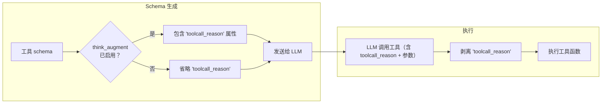

# 理由增强工具调用

ToolRegistry 可以在每个工具的参数 schema 中注入一个 `toolcall_reason` 字符串属性。这为 LLM 提供了一个专用字段，用于说明**为什么**选择该工具，以及**预期**该工具完成什么事情——在工具实际运行之前。

在 core library 中，理由增强调用**默认关闭**，可以在注册表全局启用，也可以通过 `ToolMetadata` 按工具启用。

!!! note "Hub server 默认行为"
    `toolregistry-hub` 的 OpenAPI 和 MCP server 命令默认启用该功能。如需关闭，可在 hub CLI 中使用 `--no-think-augment`。

???+ note "更新日志"
    该功能最初以 think-augmented tool calling 的形式在 [#49](../../pull/49) 中引入，灵感来自 [arXiv:2601.18282](https://arxiv.org/abs/2601.18282)。

## 工作原理



1. **注入**：当工具拥有 `properties` schema 时，`toolcall_reason` 会存在于工具的内部参数存储中。通过 `get_schemas()` 生成 schema 时，注册表会根据两层配置解析每个工具是否应暴露 `toolcall_reason`。
2. **LLM 响应**：启用后，LLM 在填写实际参数的同时，在 `toolcall_reason` 字段中填入工具选择理由。
3. **剥离**：在工具函数执行前，ToolRegistry 会移除 `toolcall_reason` 参数，使函数只接收其声明的参数。

## 启用理由增强调用

### 注册表级别

```python
from toolregistry import ToolRegistry

# 在构造时启用
registry = ToolRegistry(think_augment=True)

# 或在任意时刻切换
registry.enable_think_augment()
registry.disable_think_augment()
```

### 单个工具覆盖

单个工具可以通过 `ToolMetadata.think_augment` 覆盖注册表设置：

| 值      | 行为                                             |
|---------|--------------------------------------------------|
| `None`  | 跟随注册表设置（默认）                           |
| `True`  | 始终为该工具包含 `toolcall_reason`               |
| `False` | 始终不为该工具包含 `toolcall_reason`             |

```python
from toolregistry import ToolRegistry
from toolregistry.tool import Tool, ToolMetadata

registry = ToolRegistry()  # core 中 think_augment=False（默认）

# 该工具始终包含 toolcall_reason，即使注册表默认关闭
tool = Tool.from_function(
    my_complex_function,
    metadata=ToolMetadata(think_augment=True),
)
registry.register(tool)

# 该工具始终不包含 toolcall_reason，即使之后注册表启用
tool2 = Tool.from_function(
    my_simple_function,
    metadata=ToolMetadata(think_augment=False),
)
registry.register(tool2)
```

## 示例

```python
from toolregistry import ToolRegistry

registry = ToolRegistry(think_augment=True)

@registry.register
def get_weather(city: str) -> str:
    """Get the current weather for a city."""
    return f"Sunny in {city}"

# 发送给 LLM 的 schema 包含 "toolcall_reason"
schema = registry.get_schemas()
print(schema[0]["function"]["parameters"]["properties"].keys())
# dict_keys(['city', 'toolcall_reason'])
```

当 LLM 调用此工具时，可能产生：

```json
{
  "name": "get_weather",
  "arguments": {
    "city": "Tokyo",
    "toolcall_reason": "用户询问了东京的天气，所以我应该用 city=Tokyo 调用 get_weather。"
  }
}
```

ToolRegistry 在执行前剥离 `toolcall_reason` —— `get_weather` 只接收 `city="Tokyo"`。

## `toolcall_reason` 属性 Schema

注入的属性在 JSON schema 中如下所示：

```json
{
  "toolcall_reason": {
    "type": "string",
    "description": "Why you chose this tool and what you expect from it."
  }
}
```

它**没有**被标记为 `required`，因此 LLM 可以省略它而不会导致错误。

## 原生 `toolcall_reason` 参数

不要在真实工具函数中声明名为 `toolcall_reason` 的参数。ToolRegistry 将该名称保留给理由增强功能，并会在执行前剥离它。

如果你的函数确实需要一个面向用户的理由参数，请使用其他名称，例如 `reason`、`explanation` 或 `comment`。

## 适用范围

理由增强注入适用于所有集成路径：

- 原生 Python 函数（`@registry.register`）
- MCP 工具（`register_from_mcp`）
- OpenAPI 工具（`register_from_openapi`）
- LangChain 工具（`register_from_langchain`）
- 基于类的工具（`register_from_class`）
- 手动构建的 `Tool` 对象
