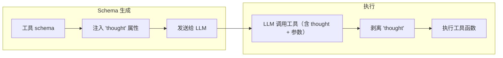

# 思维增强工具调用

ToolRegistry 会自动在每个工具的参数 schema 中注入一个 `thought` 字符串属性。这为 LLM 提供了一个专用字段，用于表达关于**为什么**选择该工具以及**如何**使用它的逐步推理——在工具实际运行之前。

???+ note "更新日志"
    新增于：[#49](../../pull/49)（Unreleased）
    参考文献：[arXiv:2601.18282](https://arxiv.org/abs/2601.18282)

## 工作原理



1. **注入**：当 `Tool` 被创建时（通过 `@registry.register`、`Tool.from_function` 或任何集成方式），`thought` 会自动添加到工具 JSON schema 的 `properties` 中。
2. **LLM 响应**：LLM 在填写实际参数的同时，在 `thought` 字段中填入其推理过程。
3. **剥离**：在工具函数执行前，ToolRegistry 移除 `thought` 参数，使函数只接收其声明的参数。

## 示例

```python
from toolregistry import ToolRegistry

registry = ToolRegistry()

@registry.register
def get_weather(city: str) -> str:
    """Get the current weather for a city."""
    return f"Sunny in {city}"

# 发送给 LLM 的 schema 包含 "thought"
schema = registry.get_schemas()
print(schema[0]["function"]["parameters"]["properties"].keys())
# dict_keys(['city', 'thought'])
```

当 LLM 调用此工具时，可能产生：

```json
{
  "name": "get_weather",
  "arguments": {
    "city": "Tokyo",
    "thought": "用户询问了东京的天气，所以我应该用 city=Tokyo 调用 get_weather。"
  }
}
```

ToolRegistry 在执行前剥离 `thought` —— `get_weather` 只接收 `city="Tokyo"`。

## `thought` 属性 Schema

注入的属性在 JSON schema 中如下所示：

```json
{
  "thought": {
    "type": "string",
    "description": "Your step-by-step reasoning about why you chose this tool and how to use it."
  }
}
```

它**没有**被标记为 `required`，因此 LLM 可以省略它而不会导致错误。

## 原生 `thought` 参数

如果你的函数本身就有一个名为 `thought` 的参数，ToolRegistry 会保留它，**不会**覆盖：

```python
@registry.register
def analyze(data: str, thought: str = "") -> str:
    """Analyze data with optional reasoning."""
    # 'thought' 是一个真实参数 —— 不会被剥离
    return f"Analysis of {data} with reasoning: {thought}"
```

ToolRegistry 通过内省检测原生 `thought` 参数，并跳过该工具的注入和剥离。

## 适用范围

思维增强注入适用于所有集成路径：

- 原生 Python 函数（`@registry.register`）
- MCP 工具（`register_from_mcp`）
- OpenAPI 工具（`register_from_openapi`）
- LangChain 工具（`register_from_langchain`）
- 基于类的工具（`register_from_class`）
- 手动构建的 `Tool` 对象
