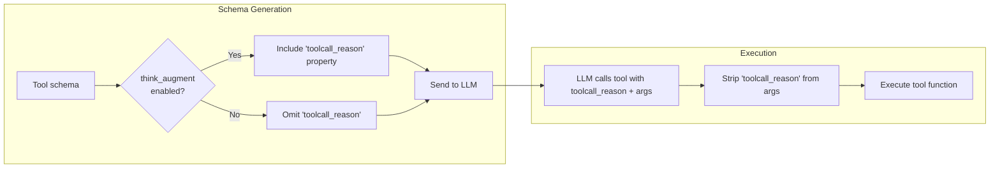

# Rationale-Augmented Tool Calling

ToolRegistry can inject a `toolcall_reason` string property into every tool's parameter schema. This gives LLMs a dedicated field to explain **why** they chose a tool and **what** they expect from it before the tool actually runs.

In the core library, rationale augmentation is **off by default** and can be enabled globally on the registry or per tool via `ToolMetadata`.

!!! note "Hub server default"
    `toolregistry-hub` enables this by default for its OpenAPI and MCP server commands. Use `--no-think-augment` in the hub CLI to disable it for served tools.

???+ note "Changelog"
    Introduced as think-augmented tool calling in [#49](../../pull/49), inspired by [arXiv:2601.18282](https://arxiv.org/abs/2601.18282).

## How It Works



1. **Injection**: Internally, `toolcall_reason` is present in the tool's parameter storage when the tool has a `properties` schema. When schemas are generated via `get_schemas()`, the registry resolves whether each tool should expose `toolcall_reason` based on the two-layer configuration.
2. **LLM response**: When enabled, the LLM fills in the `toolcall_reason` field alongside the actual arguments.
3. **Stripping**: Before the tool function executes, ToolRegistry removes the `toolcall_reason` parameter so the function receives only its declared arguments.

## Enabling Rationale-Augmented Calling

### At Registry Level

```python
from toolregistry import ToolRegistry

# Enable at construction
registry = ToolRegistry(think_augment=True)

# Or toggle at any time
registry.enable_think_augment()
registry.disable_think_augment()
```

### Per-Tool Override

Individual tools can override the registry setting via `ToolMetadata.think_augment`:

| Value   | Behavior                                               |
|---------|--------------------------------------------------------|
| `None`  | Follow the registry setting (default)                  |
| `True`  | Always include `toolcall_reason` for this tool         |
| `False` | Never include `toolcall_reason` for this tool          |

```python
from toolregistry import ToolRegistry
from toolregistry.tool import Tool, ToolMetadata

registry = ToolRegistry()  # think_augment=False by default in core

# This tool always gets toolcall_reason, even though the registry default is off
tool = Tool.from_function(
    my_complex_function,
    metadata=ToolMetadata(think_augment=True),
)
registry.register(tool)

# This tool never gets toolcall_reason, even if registry is enabled later
tool2 = Tool.from_function(
    my_simple_function,
    metadata=ToolMetadata(think_augment=False),
)
registry.register(tool2)
```

## Example

```python
from toolregistry import ToolRegistry

registry = ToolRegistry(think_augment=True)

@registry.register
def get_weather(city: str) -> str:
    """Get the current weather for a city."""
    return f"Sunny in {city}"

# The schema sent to the LLM includes "toolcall_reason"
schema = registry.get_schemas()
print(schema[0]["function"]["parameters"]["properties"].keys())
# dict_keys(['city', 'toolcall_reason'])
```

When the LLM calls this tool, it might produce:

```json
{
  "name": "get_weather",
  "arguments": {
    "city": "Tokyo",
    "toolcall_reason": "The user asked about weather in Tokyo, so I should call get_weather with city=Tokyo."
  }
}
```

ToolRegistry strips `toolcall_reason` before execution — `get_weather` only receives `city="Tokyo"`.

## The `toolcall_reason` Property Schema

The injected property looks like this in the JSON schema:

```json
{
  "toolcall_reason": {
    "type": "string",
    "description": "Why you chose this tool and what you expect from it."
  }
}
```

It is **not** marked as `required`, so LLMs may omit it without causing errors.

## Native `toolcall_reason` Parameters

Avoid declaring a real tool parameter named `toolcall_reason`. ToolRegistry reserves that name for rationale augmentation and strips it before execution.

If you need a user-facing rationale argument in your own function, use a different parameter name such as `reason`, `explanation`, or `comment`.

## Scope

Rationale augmentation works across all integration paths:

- Native Python functions (`@registry.register`)
- MCP tools (`register_from_mcp`)
- OpenAPI tools (`register_from_openapi`)
- LangChain tools (`register_from_langchain`)
- Class-based tools (`register_from_class`)
- Manually constructed `Tool` objects
