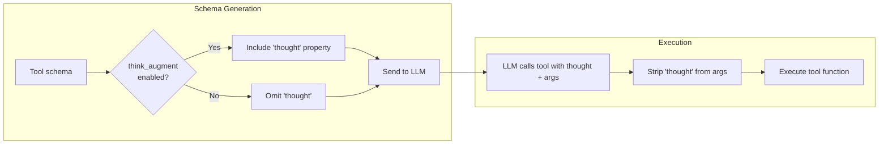

# Think-Augmented Tool Calling

ToolRegistry can inject a `thought` string property into every tool's parameter schema. This gives LLMs a dedicated field to express step-by-step reasoning about **why** they chose a tool and **how** they plan to use it — before the tool actually runs.

Think-augmented calling is **off by default** and can be enabled globally on the registry or per-tool via `ToolMetadata`.

???+ note "Changelog"
    New in: [#49](../../pull/49) (Unreleased)
    Reference: [arXiv:2601.18282](https://arxiv.org/abs/2601.18282)

## How It Works



1. **Injection**: Internally, `thought` is always present in the tool's parameter storage. When schemas are generated via `get_schemas()`, the registry resolves whether each tool should include `thought` based on the two-layer configuration.
2. **LLM response**: When enabled, the LLM fills in the `thought` field with its reasoning alongside the actual arguments.
3. **Stripping**: Before the tool function executes, ToolRegistry always removes the `thought` parameter so the function receives only its declared arguments — regardless of the toggle.

## Enabling Think-Augmented Calling

### At Registry Level

```python
from toolregistry import ToolRegistry

# Enable at construction
registry = ToolRegistry(think_augment=True)

# Or toggle at any time
registry.enable_think_augment()
registry.disable_think_augment()
```

### Per-Tool Override

Individual tools can override the registry setting via `ToolMetadata.think_augment`:

| Value   | Behavior                              |
|---------|---------------------------------------|
| `None`  | Follow the registry setting (default) |
| `True`  | Always include `thought` for this tool |
| `False` | Never include `thought` for this tool |

```python
from toolregistry import ToolRegistry
from toolregistry.tool import Tool, ToolMetadata

registry = ToolRegistry()  # think_augment=False by default

# This tool always gets thought, even though the registry default is off
tool = Tool.from_function(
    my_complex_function,
    metadata=ToolMetadata(think_augment=True),
)
registry.register(tool)

# This tool never gets thought, even if registry is enabled later
tool2 = Tool.from_function(
    my_simple_function,
    metadata=ToolMetadata(think_augment=False),
)
registry.register(tool2)
```

## Example

```python
from toolregistry import ToolRegistry

registry = ToolRegistry(think_augment=True)

@registry.register
def get_weather(city: str) -> str:
    """Get the current weather for a city."""
    return f"Sunny in {city}"

# The schema sent to the LLM includes "thought"
schema = registry.get_schemas()
print(schema[0]["function"]["parameters"]["properties"].keys())
# dict_keys(['city', 'thought'])
```

When the LLM calls this tool, it might produce:

```json
{
  "name": "get_weather",
  "arguments": {
    "city": "Tokyo",
    "thought": "The user asked about weather in Tokyo, so I should call get_weather with city=Tokyo."
  }
}
```

ToolRegistry strips `thought` before execution — `get_weather` only receives `city="Tokyo"`.

## The `thought` Property Schema

The injected property looks like this in the JSON schema:

```json
{
  "thought": {
    "type": "string",
    "description": "Your step-by-step reasoning about why you chose this tool and how to use it."
  }
}
```

It is **not** marked as `required`, so LLMs may omit it without causing errors.

## Native `thought` Parameters

If your function already has a parameter named `thought`, ToolRegistry preserves it and does **not** override it:

```python
@registry.register
def analyze(data: str, thought: str = "") -> str:
    """Analyze data with optional reasoning."""
    # 'thought' is a real parameter here — it will NOT be stripped
    return f"Analysis of {data} with reasoning: {thought}"
```

ToolRegistry detects native `thought` parameters via introspection and skips both injection and stripping for that tool.

## Scope

Think-augmented injection works across all integration paths:

- Native Python functions (`@registry.register`)
- MCP tools (`register_from_mcp`)
- OpenAPI tools (`register_from_openapi`)
- LangChain tools (`register_from_langchain`)
- Class-based tools (`register_from_class`)
- Manually constructed `Tool` objects
