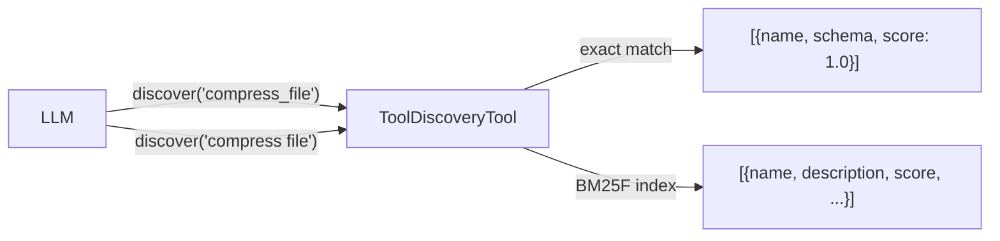

# Tool Discovery

When a registry contains dozens or hundreds of tools, sending every tool schema in the initial prompt wastes tokens and degrades LLM performance. **ToolDiscoveryTool** lets the LLM discover relevant tools on demand via exact name lookup or natural language queries, powered by BM25F (Best Matching 25 with Field weighting) sparse search.

???+ note "Changelog"
    New in: [#108](../../pull/108) (Unreleased)
    Updated in: [#114](../../pull/114) — `enable_tool_search()`, `include_deferred`, schema in search results
    Updated in: [#118](../../pull/118) — Renamed to `ToolDiscoveryTool` / `discover_tools`, added exact match, `get_deferred_summaries()`

## Overview



ToolDiscoveryTool supports two modes:

1. **Exact match** — if the query matches a registered tool name, the full schema is returned immediately (score 1.0).
2. **Fuzzy search** — otherwise, a BM25F multi-field search is performed.

Five fields are indexed per tool with configurable weights:

| Field | Default Weight | Source |
|-------|---------------|--------|
| `name` | 3.0 | Tool name (underscores → spaces) |
| `description` | 2.0 | Tool docstring / description |
| `search_hint` | 2.0 | `ToolMetadata.search_hint` |
| `tags` | 1.5 | `ToolMetadata.tags` + `custom_tags` |
| `params` | 1.0 | Parameter names from JSON schema |

## Quick Start

The easiest way to enable tool discovery is via `enable_tool_discovery()`, which registers a `discover_tools` callable into the registry so LLMs can discover tools autonomously:

```python
from toolregistry import ToolRegistry

registry = ToolRegistry()

@registry.register
def add(a: float, b: float) -> float:
    """Add two numbers together."""
    return a + b

@registry.register
def read_file(path: str) -> str:
    """Read the contents of a file from the filesystem."""
    return open(path).read()

# Enable tool discovery — registers "discover_tools" as a callable tool
registry.enable_tool_discovery()

# LLMs see discover_tools in get_schemas() and can call it to discover tools
schemas = registry.get_schemas(include_deferred=False)
```

You can also enable it at construction time:

```python
registry = ToolRegistry(tool_discovery=True)
```

### Standalone Usage

If you prefer to use `ToolDiscoveryTool` directly without registering it:

```python
from toolregistry import ToolRegistry
from toolregistry.tool_discovery import ToolDiscoveryTool

registry = ToolRegistry()
# ... register tools ...

discoverer = ToolDiscoveryTool(registry)

# Exact match — returns full schema
results = discoverer.discover("read_file")
print(results[0]["schema"])  # full tool definition

# Fuzzy search — BM25 ranking
results = discoverer.discover("read text file")
print(results[0]["name"])   # "read_file"
print(results[0]["score"])  # 1.23 (BM25 score)
```

## Discovery Results

Each result is a dict with these keys:

| Key | Type | Description |
|-----|------|-------------|
| `name` | `str` | Tool name (identifier) |
| `description` | `str` | Tool description |
| `score` | `float` | BM25 relevance score (1.0 for exact match) |
| `namespace` | `str \| None` | Tool namespace, if any |
| `deferred` | `bool` | Whether the tool is marked as deferred |
| `schema` | `dict` | Full tool schema (always for exact match; only deferred tools in fuzzy mode) |

For **exact matches**, the result always includes the full tool schema regardless of deferred status. For **fuzzy search**, only deferred tools include their schema so the LLM can call them immediately after discovery.

```python
results = discoverer.discover("email", top_k=3)
for r in results:
    print(f"{r['name']}: {r['score']:.2f} — {r['description']}")
    if r.get("schema"):
        print(f"  Schema: {r['schema']}")
```

## Progressive Disclosure

The recommended workflow for large registries:

1. **Mark rarely-used tools as deferred** with `ToolMetadata(defer=True)`
2. **Use `get_schemas(include_deferred=False)`** to send only essential tools to the LLM
3. **Inject deferred tool summaries** via `get_deferred_summaries()` into the system prompt
4. **Enable `discover_tools`** so the LLM can look up any tool by name or query

```python
from toolregistry import Tool, ToolMetadata, ToolTag

registry = ToolRegistry(tool_discovery=True)

# Core tools — always visible
@registry.register
def add(a: float, b: float) -> float:
    """Add two numbers."""
    return a + b

# Deferred tools — discoverable on demand
registry.register(
    Tool.from_function(
        compress_file,
        metadata=ToolMetadata(
            defer=True,
            tags={ToolTag.FILE_SYSTEM},
        ),
    )
)

# 1. Non-deferred schemas for LLM tools parameter
schemas = registry.get_schemas(include_deferred=False)

# 2. Deferred summaries for system prompt
summaries = registry.get_deferred_summaries()
# [{"name": "compress_file", "description": "Compress a file into a zip archive.", "namespace": None}]
```

### Deferred Summaries

`get_deferred_summaries()` returns a lightweight list of deferred tool names with first-sentence descriptions, suitable for system prompt injection:

```python
summaries = registry.get_deferred_summaries()
for s in summaries:
    print(f"- {s['name']}: {s['description']}")
```

Each summary contains:

| Key | Type | Description |
|-----|------|-------------|
| `name` | `str` | Tool name |
| `description` | `str` | First sentence of the tool description |
| `namespace` | `str \| None` | Tool namespace, if any |

Only **enabled** deferred tools are included. The description is truncated to the first sentence (text before the first `. ` on the first line).

## Search Hints

Use `ToolMetadata.search_hint` to add synonyms, related concepts, or domain-specific terms that improve discoverability:

```python
registry.register(
    Tool.from_function(
        read_file,
        metadata=ToolMetadata(
            search_hint="open load text content cat",
        ),
    )
)
```

The `search_hint` field is indexed at weight 2.0 (same as `description`), so these keywords influence ranking just as strongly as the tool's own description.

## Custom Field Weights

Override the default BM25F field weights to tune ranking for your use case:

```python
# Via enable_tool_discovery()
registry.enable_tool_discovery(field_weights={
    "name": 5.0,          # Boost exact name matches
    "description": 1.0,
    "tags": 3.0,          # Boost tag-based discovery
    "params": 0.5,
    "search_hint": 2.0,
})

# Or via standalone ToolDiscoveryTool
discoverer = ToolDiscoveryTool(
    registry,
    field_weights={
        "name": 5.0,
        "description": 1.0,
        "tags": 3.0,
        "params": 0.5,
        "search_hint": 2.0,
    },
)
```

## Rebuilding the Index

When tool discovery is enabled via `enable_tool_discovery()`, the index **automatically rebuilds** whenever tools are registered or unregistered, powered by the ChangeCallback mechanism. No manual intervention is needed.

For standalone `ToolDiscoveryTool` usage, the index is built once at construction time. After modifying the registry, call `rebuild_index()` manually:

```python
@registry.register
def new_tool(x: int) -> int:
    """A newly added tool."""
    return x * 2

discoverer.rebuild_index()

results = discoverer.discover("newly added")
assert results[0]["name"] == "new_tool"
```

## Implementation Details

ToolDiscoveryTool uses a vendored copy of [zerodep](https://pypi.org/project/zerodep/)'s `SparseIndex` (v0.2.2) — a pure-Python BM25/BM25F implementation with **zero external dependencies**. The index lives entirely in memory and is typically negligible in size (100 tools ≈ a few KB).

BM25F parameters:

- `k1 = 1.5` — term frequency saturation
- `b = 0.75` — document length normalization
- `delta = 1.0` — BM25+ floor correction
