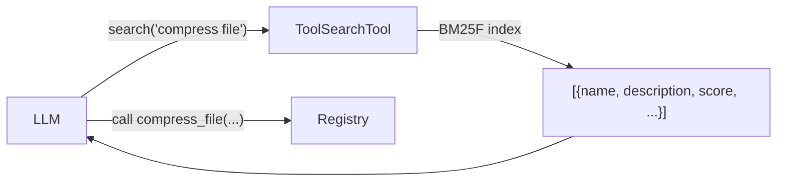

# Tool Search

When a registry contains dozens or hundreds of tools, sending every tool schema in the initial prompt wastes tokens and degrades LLM performance. **ToolSearchTool** lets the LLM discover relevant tools on demand via natural language queries, powered by BM25F (Best Matching 25 with Field weighting) sparse search.

???+ note "Changelog"
    New in: [#108](../../pull/108) (Unreleased)

## Overview



ToolSearchTool indexes five fields per tool with configurable weights:

| Field | Default Weight | Source |
|-------|---------------|--------|
| `name` | 3.0 | Tool name (underscores → spaces) |
| `description` | 2.0 | Tool docstring / description |
| `search_hint` | 2.0 | `ToolMetadata.search_hint` |
| `tags` | 1.5 | `ToolMetadata.tags` + `custom_tags` |
| `params` | 1.0 | Parameter names from JSON schema |

## Quick Start

```python
from toolregistry import ToolRegistry, ToolSearchTool

registry = ToolRegistry()

@registry.register
def add(a: float, b: float) -> float:
    """Add two numbers together."""
    return a + b

@registry.register
def read_file(path: str) -> str:
    """Read the contents of a file from the filesystem."""
    return open(path).read()

# Create a searcher over the registry
searcher = ToolSearchTool(registry)

# Search by natural language
results = searcher.search("read text file")
print(results[0]["name"])   # "read_file"
print(results[0]["score"])  # 1.23 (BM25 score)
```

## Search Results

Each result is a dict with these keys:

| Key | Type | Description |
|-----|------|-------------|
| `name` | `str` | Tool name (identifier) |
| `description` | `str` | Tool description |
| `score` | `float` | BM25 relevance score (higher = more relevant) |
| `namespace` | `str \| None` | Tool namespace, if any |
| `deferred` | `bool` | Whether the tool is marked as deferred |

```python
results = searcher.search("email", top_k=3)
for r in results:
    print(f"{r['name']}: {r['score']:.2f} — {r['description']}")
```

## Deferred Tools

Mark tools with `ToolMetadata(defer=True)` to exclude them from the initial prompt. They remain searchable via ToolSearchTool:

```python
from toolregistry import Tool, ToolMetadata, ToolTag

def compress_file(path: str) -> str:
    """Compress a file into a zip archive."""
    ...

registry.register(
    Tool.from_function(
        compress_file,
        metadata=ToolMetadata(
            defer=True,  # excluded from initial get_schemas()
            tags={ToolTag.FILE_SYSTEM},
        ),
    )
)

# Deferred tools are still discoverable
results = searcher.search("compress zip")
assert results[0]["name"] == "compress_file"
assert results[0]["deferred"] is True
```

!!! info "Future work"
    Framework-level automatic schema injection for deferred tools (dynamically adding a deferred tool's schema to the prompt when the LLM discovers it) is planned but not yet implemented.

## Search Hints

Use `ToolMetadata.search_hint` to add synonyms, related concepts, or domain-specific terms that improve discoverability:

```python
registry.register(
    Tool.from_function(
        read_file,
        metadata=ToolMetadata(
            search_hint="open load text content cat",
        ),
    )
)
```

The `search_hint` field is indexed at weight 2.0 (same as `description`), so these keywords influence ranking just as strongly as the tool's own description.

## Custom Field Weights

Override the default BM25F field weights to tune ranking for your use case:

```python
searcher = ToolSearchTool(
    registry,
    field_weights={
        "name": 5.0,          # Boost exact name matches
        "description": 1.0,
        "tags": 3.0,          # Boost tag-based discovery
        "params": 0.5,
        "search_hint": 2.0,
    },
)
```

## Rebuilding the Index

The index is built once at construction time. After modifying the registry (adding, removing, or updating tools), call `rebuild_index()`:

```python
@registry.register
def new_tool(x: int) -> int:
    """A newly added tool."""
    return x * 2

searcher.rebuild_index()

results = searcher.search("newly added")
assert results[0]["name"] == "new_tool"
```

!!! tip
    Automatic index updates via ChangeCallback are planned for a future release. For now, call `rebuild_index()` manually after registry changes.

## Implementation Details

ToolSearchTool uses a vendored copy of [zerodep](https://pypi.org/project/zerodep/)'s `SparseIndex` (v0.2.2) — a pure-Python BM25/BM25F implementation with **zero external dependencies**. The index lives entirely in memory and is typically negligible in size (100 tools ≈ a few KB).

BM25F parameters:

- `k1 = 1.5` — term frequency saturation
- `b = 0.75` — document length normalization
- `delta = 1.0` — BM25+ floor correction
