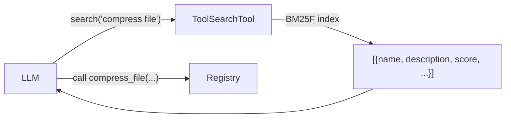

# Tool Search

When a registry contains dozens or hundreds of tools, sending every tool schema in the initial prompt wastes tokens and degrades LLM performance. **ToolSearchTool** lets the LLM discover relevant tools on demand via natural language queries, powered by BM25F (Best Matching 25 with Field weighting) sparse search.

???+ note "Changelog"
    New in: [#108](../../pull/108) (Unreleased)
    Updated in: [#114](../../pull/114) — `enable_tool_search()`, `include_deferred`, schema in search results

## Overview



ToolSearchTool indexes five fields per tool with configurable weights:

| Field | Default Weight | Source |
|-------|---------------|--------|
| `name` | 3.0 | Tool name (underscores → spaces) |
| `description` | 2.0 | Tool docstring / description |
| `search_hint` | 2.0 | `ToolMetadata.search_hint` |
| `tags` | 1.5 | `ToolMetadata.tags` + `custom_tags` |
| `params` | 1.0 | Parameter names from JSON schema |

## Quick Start

The easiest way to enable tool search is via `enable_tool_search()`, which registers a `search_tools` callable into the registry so LLMs can discover tools autonomously:

```python
from toolregistry import ToolRegistry

registry = ToolRegistry()

@registry.register
def add(a: float, b: float) -> float:
    """Add two numbers together."""
    return a + b

@registry.register
def read_file(path: str) -> str:
    """Read the contents of a file from the filesystem."""
    return open(path).read()

# Enable tool search — registers "search_tools" as a callable tool
registry.enable_tool_search()

# LLMs see search_tools in get_schemas() and can call it to discover tools
schemas = registry.get_schemas(include_deferred=False)
```

You can also enable it at construction time:

```python
registry = ToolRegistry(tool_search=True)
```

### Standalone Usage

If you prefer to use `ToolSearchTool` directly without registering it:

```python
from toolregistry import ToolRegistry
from toolregistry.tool_search import ToolSearchTool

registry = ToolRegistry()
# ... register tools ...

searcher = ToolSearchTool(registry)
results = searcher.search("read text file")
print(results[0]["name"])   # "read_file"
print(results[0]["score"])  # 1.23 (BM25 score)
```

## Search Results

Each result is a dict with these keys:

| Key | Type | Description |
|-----|------|-------------|
| `name` | `str` | Tool name (identifier) |
| `description` | `str` | Tool description |
| `score` | `float` | BM25 relevance score (higher = more relevant) |
| `namespace` | `str \| None` | Tool namespace, if any |
| `deferred` | `bool` | Whether the tool is marked as deferred |
| `schema` | `dict \| None` | Full tool schema (only present for deferred tools) |

For **deferred tools**, the result includes the full tool schema so that the LLM can immediately call the discovered tool without a second round-trip.

```python
results = searcher.search("email", top_k=3)
for r in results:
    print(f"{r['name']}: {r['score']:.2f} — {r['description']}")
    if r.get("schema"):
        print(f"  Schema: {r['schema']}")
```

## Deferred Tools

Mark tools with `ToolMetadata(defer=True)` to exclude them from the initial prompt. Use `get_schemas(include_deferred=False)` to filter them out. Deferred tools remain searchable via ToolSearchTool, and their **full schema is included in search results** so the LLM can call them immediately after discovery:

```python
from toolregistry import Tool, ToolMetadata, ToolTag

registry = ToolRegistry(tool_search=True)

def compress_file(path: str) -> str:
    """Compress a file into a zip archive."""
    ...

registry.register(
    Tool.from_function(
        compress_file,
        metadata=ToolMetadata(
            defer=True,  # excluded when include_deferred=False
            tags={ToolTag.FILE_SYSTEM},
        ),
    )
)

# Only non-deferred tools + search_tools in initial schemas
schemas = registry.get_schemas(include_deferred=False)

# Deferred tools are still discoverable via search
results = registry._tool_search.search("compress zip")
assert results[0]["name"] == "compress_file"
assert results[0]["deferred"] is True
assert "schema" in results[0]  # schema included for deferred tools
```

!!! tip
    The `schema` field in search results provides the full tool definition so that the LLM can construct a valid function call without needing the deferred tool's schema to be in the initial prompt.

## Search Hints

Use `ToolMetadata.search_hint` to add synonyms, related concepts, or domain-specific terms that improve discoverability:

```python
registry.register(
    Tool.from_function(
        read_file,
        metadata=ToolMetadata(
            search_hint="open load text content cat",
        ),
    )
)
```

The `search_hint` field is indexed at weight 2.0 (same as `description`), so these keywords influence ranking just as strongly as the tool's own description.

## Custom Field Weights

Override the default BM25F field weights to tune ranking for your use case:

```python
# Via enable_tool_search()
registry.enable_tool_search(field_weights={
    "name": 5.0,          # Boost exact name matches
    "description": 1.0,
    "tags": 3.0,          # Boost tag-based discovery
    "params": 0.5,
    "search_hint": 2.0,
})

# Or via standalone ToolSearchTool
searcher = ToolSearchTool(
    registry,
    field_weights={
        "name": 5.0,
        "description": 1.0,
        "tags": 3.0,
        "params": 0.5,
        "search_hint": 2.0,
    },
)
```

## Rebuilding the Index

When tool search is enabled via `enable_tool_search()`, the index **automatically rebuilds** whenever tools are registered or unregistered, powered by the ChangeCallback mechanism. No manual intervention is needed.

For standalone `ToolSearchTool` usage, the index is built once at construction time. After modifying the registry, call `rebuild_index()` manually:

```python
@registry.register
def new_tool(x: int) -> int:
    """A newly added tool."""
    return x * 2

searcher.rebuild_index()

results = searcher.search("newly added")
assert results[0]["name"] == "new_tool"
```

## Implementation Details

ToolSearchTool uses a vendored copy of [zerodep](https://pypi.org/project/zerodep/)'s `SparseIndex` (v0.2.2) — a pure-Python BM25/BM25F implementation with **zero external dependencies**. The index lives entirely in memory and is typically negligible in size (100 tools ≈ a few KB).

BM25F parameters:

- `k1 = 1.5` — term frequency saturation
- `b = 0.75` — document length normalization
- `delta = 1.0` — BM25+ floor correction
