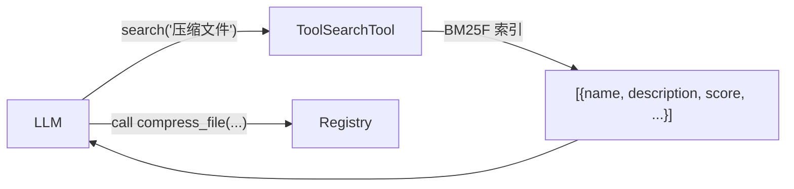

# 工具搜索

当注册表包含数十甚至数百个工具时，在初始提示中发送所有工具 schema 会浪费 token 并降低 LLM 性能。**ToolSearchTool** 允许 LLM 通过自然语言查询按需发现相关工具，底层使用 BM25F（带字段加权的最佳匹配 25）稀疏搜索。

???+ note "更新日志"
    新增于：[#108](../../pull/108)（Unreleased）
    更新于：[#114](../../pull/114) — `enable_tool_search()`、`include_deferred`、搜索结果包含 schema

## 概览



ToolSearchTool 为每个工具索引五个字段，支持可配置权重：

| 字段 | 默认权重 | 来源 |
|------|---------|------|
| `name` | 3.0 | 工具名称（下划线转空格） |
| `description` | 2.0 | 工具文档字符串 / 描述 |
| `search_hint` | 2.0 | `ToolMetadata.search_hint` |
| `tags` | 1.5 | `ToolMetadata.tags` + `custom_tags` |
| `params` | 1.0 | JSON schema 中的参数名 |

## 快速开始

最简单的启用方式是通过 `enable_tool_search()`，它会将 `search_tools` 注册为 registry 中的可调用工具，让 LLM 可以自主发现工具：

```python
from toolregistry import ToolRegistry

registry = ToolRegistry()

@registry.register
def add(a: float, b: float) -> float:
    """Add two numbers together."""
    return a + b

@registry.register
def read_file(path: str) -> str:
    """Read the contents of a file from the filesystem."""
    return open(path).read()

# 启用工具搜索 — 注册 "search_tools" 为可调用工具
registry.enable_tool_search()

# LLM 在 get_schemas() 中可以看到 search_tools 并调用它来发现工具
schemas = registry.get_schemas(include_deferred=False)
```

也可以在构造时启用：

```python
registry = ToolRegistry(tool_search=True)
```

### 独立使用

如果你更想直接使用 `ToolSearchTool` 而不将其注册到 registry 中：

```python
from toolregistry import ToolRegistry
from toolregistry.tool_search import ToolSearchTool

registry = ToolRegistry()
# ... 注册工具 ...

searcher = ToolSearchTool(registry)
results = searcher.search("read text file")
print(results[0]["name"])   # "read_file"
print(results[0]["score"])  # 1.23 (BM25 分数)
```

## 搜索结果

每个结果是一个包含以下键的字典：

| 键 | 类型 | 说明 |
|----|------|------|
| `name` | `str` | 工具名称（标识符） |
| `description` | `str` | 工具描述 |
| `score` | `float` | BM25 相关性分数（越高越相关） |
| `namespace` | `str \| None` | 工具命名空间（如有） |
| `deferred` | `bool` | 工具是否标记为延迟加载 |
| `schema` | `dict \| None` | 完整工具 schema（仅延迟加载工具包含） |

对于**延迟加载的工具**，结果中包含完整的工具 schema，使 LLM 发现工具后可以立即调用，无需额外的往返请求。

```python
results = searcher.search("email", top_k=3)
for r in results:
    print(f"{r['name']}: {r['score']:.2f} — {r['description']}")
    if r.get("schema"):
        print(f"  Schema: {r['schema']}")
```

## 延迟加载工具

使用 `ToolMetadata(defer=True)` 标记工具，将其从初始提示中排除。通过 `get_schemas(include_deferred=False)` 过滤它们。延迟加载的工具仍可通过 ToolSearchTool 被搜索到，且搜索结果中**包含完整的 schema**，使 LLM 发现后可以立即调用：

```python
from toolregistry import Tool, ToolMetadata, ToolTag

registry = ToolRegistry(tool_search=True)

def compress_file(path: str) -> str:
    """Compress a file into a zip archive."""
    ...

registry.register(
    Tool.from_function(
        compress_file,
        metadata=ToolMetadata(
            defer=True,  # include_deferred=False 时被排除
            tags={ToolTag.FILE_SYSTEM},
        ),
    )
)

# 初始 schema 中仅包含非延迟工具 + search_tools
schemas = registry.get_schemas(include_deferred=False)

# 延迟加载的工具仍可通过搜索被发现
results = registry._tool_search.search("compress zip")
assert results[0]["name"] == "compress_file"
assert results[0]["deferred"] is True
assert "schema" in results[0]  # 延迟工具包含 schema
```

!!! tip
    搜索结果中的 `schema` 字段提供完整的工具定义，使 LLM 无需在初始提示中包含延迟工具的 schema 即可构造有效的函数调用。

## 搜索提示

使用 `ToolMetadata.search_hint` 添加同义词、相关概念或领域特定术语，以提高工具的可发现性：

```python
registry.register(
    Tool.from_function(
        read_file,
        metadata=ToolMetadata(
            search_hint="open load text content cat",
        ),
    )
)
```

`search_hint` 字段的索引权重为 2.0（与 `description` 相同），因此这些关键词对排名的影响与工具自身描述一样强。

## 自定义字段权重

覆盖默认 BM25F 字段权重以调整排名策略：

```python
# 通过 enable_tool_search()
registry.enable_tool_search(field_weights={
    "name": 5.0,          # 提高精确名称匹配权重
    "description": 1.0,
    "tags": 3.0,          # 提高基于标签的发现权重
    "params": 0.5,
    "search_hint": 2.0,
})

# 或通过独立的 ToolSearchTool
searcher = ToolSearchTool(
    registry,
    field_weights={
        "name": 5.0,
        "description": 1.0,
        "tags": 3.0,
        "params": 0.5,
        "search_hint": 2.0,
    },
)
```

## 重建索引

通过 `enable_tool_search()` 启用工具搜索时，索引会在工具注册或注销时**自动重建**，由 ChangeCallback 机制驱动，无需手动干预。

对于独立使用 `ToolSearchTool` 的场景，索引在构造时一次性构建。修改注册表后，需手动调用 `rebuild_index()`：

```python
@registry.register
def new_tool(x: int) -> int:
    """A newly added tool."""
    return x * 2

searcher.rebuild_index()

results = searcher.search("newly added")
assert results[0]["name"] == "new_tool"
```

## 实现细节

ToolSearchTool 使用 [zerodep](https://pypi.org/project/zerodep/) 的 `SparseIndex`（v0.2.2）的内置副本——一个纯 Python BM25/BM25F 实现，**零外部依赖**。索引完全存储在内存中，大小通常可忽略不计（100 个工具 ≈ 几 KB）。

BM25F 参数：

- `k1 = 1.5` — 词频饱和度
- `b = 0.75` — 文档长度归一化
- `delta = 1.0` — BM25+ 下限修正
